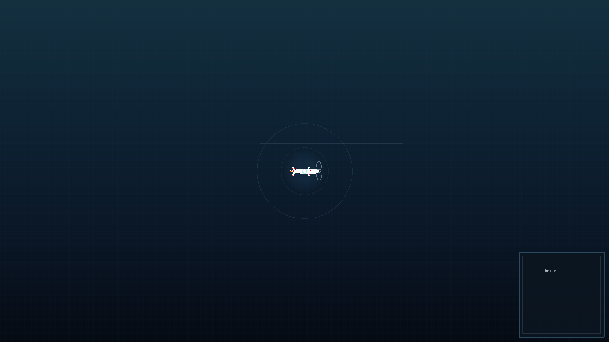
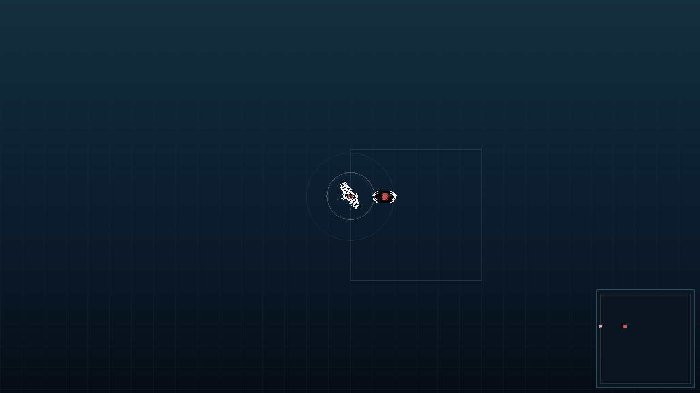
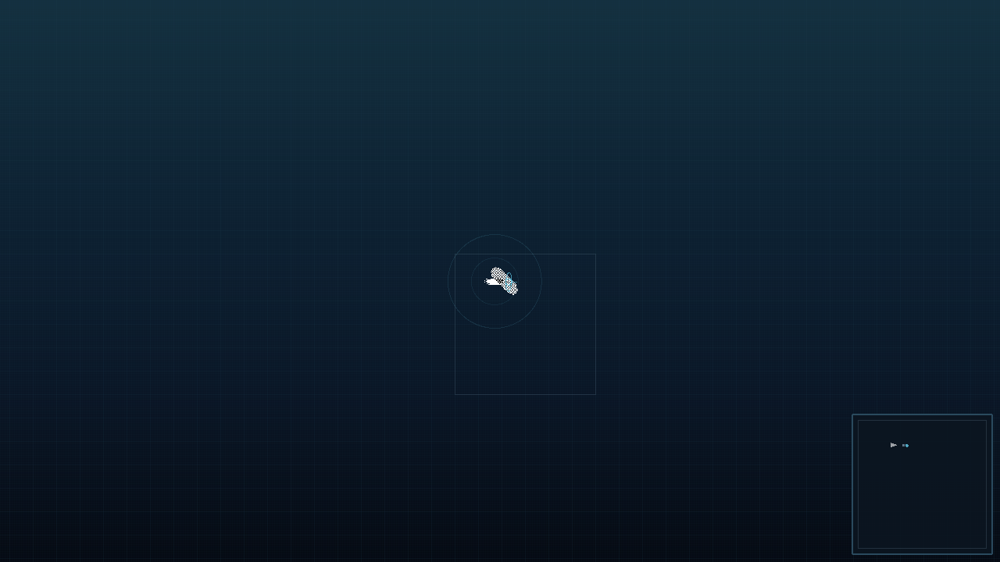
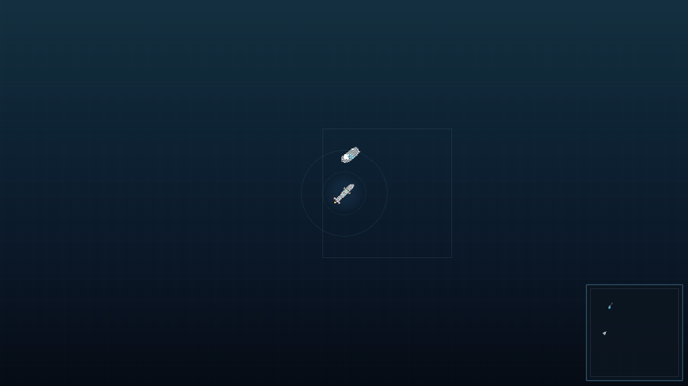
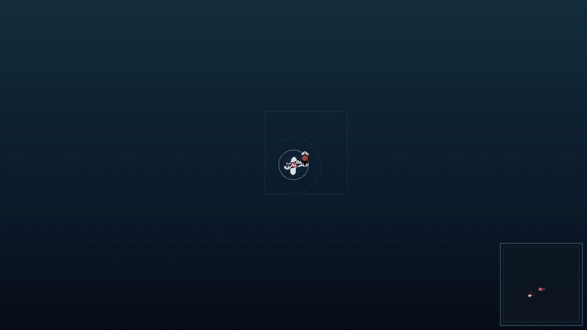
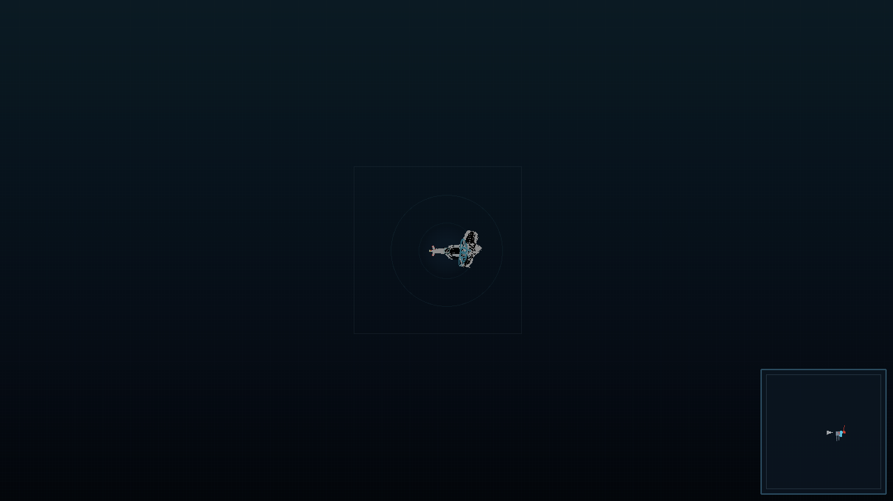

# SILENT DEPTH 《深海猎手》

**2D 战术潜艇伏击游戏** — 核心体验是**在信息不完整的情况下做决策**:听 → 判 → 追 → 算 → 伏 → 攻 → 藏 → 逃。你不是"看到敌人再开火",而是通过声呐听见、判断、跟踪、预测,在敌方搜索与反击中完成伏击。

纯 TypeScript 确定性引擎(headless-first)+ Canvas 2D + WebAudio 程序化音效 + 全程序化素材。**完全离线运行,零运行时依赖,零第三方素材,零外部网络请求**。

---

## 📸 游戏画面

> 以下为**程序化预览渲染**(真实引擎 + 真实渲染器在无头环境下绘制,非浏览器实拍)。
> 游戏内按 **F12** 可随时截取真实画面(PNG 自动下载)。

 | | |
|---|---|
|  |  |
| **游戏实拍** — 完整 UI 布局:深度/速度/航向 HUD + 声呐接触列表 + 火控解算面板 + 小地图运动轨迹 + 潜艇俯视图 | **M02 首次伏击** — 环境渲染预览:油轮接触(不确定性椭圆)+ 声呐 ping 扩散环 |
|  |  |
| **M03 袭击护航队** — 货船编队 + 驱逐舰护航,接触以椭圆而非红点呈现 | **鱼雷航行** — 无自动锁定,直航 + 尾迹气泡,命中靠提前量 |
|  |  |
| **M01 声呐训练** — 目标跟踪与分类:ping 环 + 接触椭圆收敛 | **M04 重装护航** — 风暴 + 双驱逐舰护航,低能见度下的接触管理 |
|  | |
| **M05 静默猎手** — 夜间 + 浓雾叠层,低能见度下的伏击 | |

---

## ✨ 特性

- **声呐是信息层(P0)**:主动 ping(信息↑ 暴露↑)vs 被动监听(信息↓ 暴露↓);接触从不精确——首次仅方位角,随跟踪收敛(射程 ±10%→±2%,航向 ±20%→±5%)
- **渐进分类**:Unknown → Large Surface → Merchant 72% → Confirmed,基于速度/噪声/深度特征投票
- **敌方 AI 状态机**:NORMAL → SUSPICIOUS → ALERT → SEARCHING → HUNTING → LOST_CONTACT;以"最后已知位置(LKP)"为中心执行圆形/之字/扩张搜索
- **护航编队**:2×2 商船队形 + figure-8 巡逻护航舰,鱼雷/爆炸/噪声触发不同响应优先级
- **无自动锁定鱼雷**:火控解算(提前角 + 命中概率)只做辅助,出管后直航,命中率 = 你的跟踪质量
- **探测计与逃脱**:噪声↑ → 探测↑;静默、下潜、变向、诱饵(decoy)主动压低探测;F9 逃脱判定
- **5 个任务 + 种子任务生成器**:同一种子可复现同一任务(可重放、可调试)
- **程序化世界**:5 种天气(晴/多云/风暴/浓雾/夜间)影响能见度、声呐与探测
- **存档**:任务解锁链、最高分、统计(localStorage,无账号)

## 🚀 快速开始

```bash
npm install
npm run dev        # 开发 (http://localhost:5173)
npm run build      # 生成离线静态构建 → dist/
npm run preview    # 预览生产构建
npm test           # 489 项测试 (vitest, 28 文件)
```

> 直接玩:构建后打开 `dist/index.html` 即可,无需服务器。

## 🎮 操作

| 键 | 动作 | 键 | 动作 |
|---|---|---|---|
| **W / S** | 加速 / 减速 | **G** | 释放假目标 Decoy |
| **A / D** | 左转 / 右转 | **P** | 升起 / 降下潜望镜 |
| **Q / E** | 深度层切换 | **L** | 锁定潜望镜目标 |
| **Space** | 主动声呐 Ping | **X** | 紧急下潜 |
| **F** | 发射鱼雷(选中接触) | **Esc** | 暂停菜单(暂停/继续 · 重开 · 中止) |
| **R** | 静默运行 | **F12** | 截图(PNG 下载) |

> 潜望镜机制(观察 / 锁定 / 紧急下潜)见 docs/README.md「Periscope (t-026)」。暂停已移至 Esc 菜单。

## 🗺️ 任务

| ID | 任务 | 目标 | 敌情 | 天气 | 难度 |
|---|---|---|---|---|---|
| M01 | 声呐训练 | 找到→分类→跟踪商船 | 1 × Merchant | 晴 | 简单 |
| M02 | 首次伏击 | 击沉运输船 | 1 × Tanker | 晴→多云 | 简单-中等 |
| M03 | 袭击护航队 | 击沉 ≥2 货船 | 4 × Cargo + 1 × Destroyer | 多云→风暴 | 中等 |
| M04 | 重装护航 | 击沉 ≥2 且存活 | 4 × Cargo + 2 × Destroyer | 风暴→浓雾 | 困难 |
| M05 | 静默猎手 | 击沉 ≥1 且成功逃脱 | 4 × Cargo + 2 × Destroyer + 1 × Frigate | 夜间 + 浓雾 | 极难 |

## 🏆 评分

| 等级 | 分数 |
|---|---|
| Perfect | 1000 |
| Excellent | 800–999 |
| Good | 600–799 |
| Poor | 400–599 |
| Failed | <400 |

权重:目标 40% · 伤害 20% · 隐匿 15% · 鱼雷效率 10% · 时间 10% · 存活/逃脱 5%(基于真实数据计算)。

## 📚 文档

| 文档 | 内容 |
|---|---|
| [docs/README.md](docs/README.md) | 完整说明(控制/任务/评分) |
| [docs/GAME_DESIGN.md](docs/GAME_DESIGN.md) | 游戏设计 + 平衡目标(B1–B10)+ 平衡公式(F1–F10) |
| [docs/GAME_ARCHITECTURE.md](docs/GAME_ARCHITECTURE.md) | 引擎架构、模块图、事件目录、确定性策略 |
| [docs/VISUAL_STYLE.md](docs/VISUAL_STYLE.md) | 视觉风格圣经(调色板/分辨率/图标/动效) |
| [docs/AUDIO_DESIGN.md](docs/AUDIO_DESIGN.md) | 14 个 WebAudio 程序化音效合成规格 |
| [docs/ASSET_PIPELINE.md](docs/ASSET_PIPELINE.md) | 素材管线 + 许可证闸门 |
| [RELEASE_NOTES.md](RELEASE_NOTES.md) | v1.0.0 发布说明 |
| `reports/` | 生产证据:TEST / PLAYTEST / BALANCE / SECURITY / BUILD 报告 |
| `factory/` | **工厂生产记录**:审计/需求修订/角色契约/ADR/失败账本/任务DAG/验收矩阵 |

## 🏭 生产背景

本项目由 **DeepSeek Software Factory** 全自主生产(需求 → 设计 → 架构 → 实现 → 测试 → AI Playtest → 平衡 → 构建 → 交付),作为 **GAME PRODUCTION BENCHMARK**。要点:

- **确定性**:全系统种子化 RNG,同种子同操作 → 完全可复现(测试证明 3000-tick 快照 byte-identical)
- **AI Playtest**:12 次无头试玩、5 次胜利(M01/M02/生成任务),失败均带证据
- **诚实记录**:所有素材程序化生成(CC0)、零第三方版权素材、零运行时网络;平衡调整全部证据驱动
- **质量门槛**:16 道 Gate 全部通过,**489/489 测试**(28 文件,发布后补入 screenshots 测试套件),离线构建验证通过

## 🏭 工厂生产证据（DeepSeek Software Factory V0.3）

本游戏由 **DeepSeek Software Factory V0.3（Documentation & Evidence Factory）** 全自主生产，
完整生产证据链已归档于 `factory/` 目录与交付包：

| 证据 | 数据 |
|---|---|
| 需求追踪 | **28/28 需求 VERIFIED**（FR-01..22 功能 + FR-1..6 非功能，覆盖 100%） |
| 测试 | **489/489 通过**（28 文件，真实运行）· 验收矩阵 28 项全 PASS |
| 证据链 | **36 条证据全部 AUDITED**（VERIFIED → 审计复核，rawReference 可逐条核对） |
| 审计 | **FINAL AUDIT: RELEASE**（8 次审计记录，初始 BLOCK_RELEASE → 补齐证据 → 0 失败） |
| 文档 | **31 份 game-profile 文档**，Documentation Gate **PASSED** · 一致性 0 FLAG · health **GOOD** |
| 交付包 | **158 文件** + MANIFEST(sha256) + FINAL_DELIVERY_REPORT（RELEASE） |

- `factory/reports/acceptance-matrix.md` — 真实验收矩阵（28 项逐项证据）
- `factory/memory/evidence.jsonl` — 36 条证据（DECLARED→AUDITED 级别纪律）
- `factory/memory/audits/` — 8 次审计记录（含初始 BLOCK_RELEASE 的诚实缺口暴露）
- `factory/requirements/reqs.json` — 28 个结构化需求（追踪矩阵）
- `factory/plans/` — Plan v1/v2（含需求变更重规划）
- `factory/artifacts/` — 版本化产物（sha256 快照 + 依赖图）

> 完整审计报告：`factory/reports/FINAL_DELIVERY_REPORT.md`（Audit 决策 RELEASE）。
> 工厂侧交付记录：`deepseek_software/reports/review/FINAL_AUDIT_REPORT_p004.md`。

## 已知限制

- M03+ 的**脚本化** AI 胜利尚未达成(护航压迫 + 商船散开 + 电池上限),人工玩家采用"静默伏击"战术可通关;详见 `reports/balance/BALANCE_REPORT.md`
- 视觉表现已有**无头软件画布**渲染测试覆盖(`renderer.test.ts` 分支 + `screenshots.test.ts` 预览图),但未在**真实浏览器**执行;建议 `npm run preview` 手动验收
