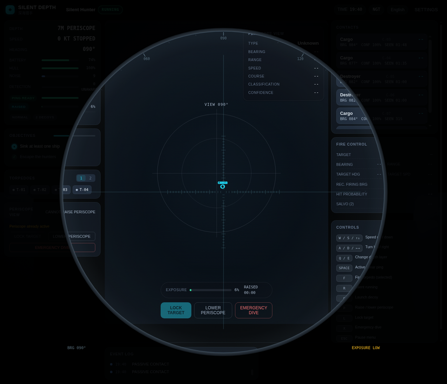

# SILENT DEPTH V2.1 Visual Audit

**审计版本：** V2.1  
**审计日期：** 2026-08-27  
**审计对象：** 当前工作树、真实 Chromium 运行画面、既有浏览器审计证据，以及公开可核验的竞品与资产来源。  
**审计结论：** 当前版本已经摆脱“纯 2D 原型”，但还未形成足以支撑潜艇战术模拟沉浸感的**资产可信度、低照度层次和电影化镜头语言**。V2.2 应以“少量可近看、可识别、可受光的英雄资产”替换“代码生成的可用几何体”，而非以更多 HUD、更多粒子或更重后期掩盖主体问题。

> **审计边界。** 本文仅评估呈现层；`RenderState` 是从确定性仿真向渲染层的单向只读桥接，渲染器不得向仿真写回数据。[1] 本审计没有改动玩法、AI、数值、任务或声呐逻辑。

*图 1：M05 在 7 m 潜望镜深度启用光学视图的真实 Chromium 截图。圆形遮罩、刻度和接触信息确实存在；但圆内目标仍主要呈文字/点状信息，圆外完整 HUD 仍形成显著的注意力竞争。*

## 1. 证据基础与审计方法

代码审阅覆盖了 Three.js 编排、潜艇与舰船程序化几何、海面/天空/天气着色器、相机、潜望镜、战术叠层和只读渲染数据契约。浏览器现场复核覆盖 M05 夜间的世界视图、由 21 m 浅潜上浮至 7 m 潜望镜深度、潜望镜光学遮罩及多接触战术叠层；逐项观察记录和截图存放在 `reports/v2.2-visual-audit/`。现有功能“在代码中存在”不等同于“在真实画面中清晰可感”，本文对两者分别标注。

外部基准以七款用户指定作品为范围，并以官方商店页、开发商页面和官方视频为主要证据。它们共同说明：潜艇战术的高级感并非来自常驻复杂 UI，而是来自**可辨认的剪影、受天气约束的可见性、事件驱动镜头、以及把不确定性编码为可读线索**。[2] [3] [4] [5] [6] [7] [8]

| 证据类型 | 已完成项目 | 审计中的使用方式 | 局限 |
|---|---|---|---|
| 真实浏览器 | M01–M05 基线、M05 夜间、潜望镜、主动声呐/接触叠层 | 判断可见性、遮挡、实际构图和信息密度 | 受控浏览器的 `requestAnimationFrame` 约 6.7 FPS，不作为目标硬件性能判定。 |
| 代码审阅 | `src/renderer/three/*`、`src/renderer/procedural/*`、`src/renderer/types.ts` | 判断现有能力、成本和不可见根因 | 不把未在真实运行中复核的效果写成“已验证体验”。 |
| 官方竞品页面 | Cold Waters、UBOAT、Barotrauma、Wolfpack、Silent Hunter、Destroyer、World of Warships | 提炼视觉设计原则和反例 | 不复制竞品美术资产、标识或玩法系统。 |
| 官方视频 | UBOAT Full Release Official Trailer | 观察夜雾、火光局部照明、战术图和潜望镜的镜头语言 | 视频是艺术参考，不是技术实现指标。 |
| 资产许可页 | Poly Haven、Kenney、Sketchfab 单资产页等 | 制定资产获取的许可闸门 | 所有候选必须在下载时重新核验作者、许可、文件与校验值。 |

## 2. 视觉评分卡

评分采用 **1–10 分**，其中 5 表示“功能成立但仅是基础实现”，7 表示“发布级且风格统一”，9 表示“可作为同类独立作品的视觉标杆”。总分为 25 项等权平均的 **3.88 / 10**；该均值用于确定资源优先级，不应被误解为客观画质基准。

| # | 类别 | 分数 | 证据与问题诊断 | V2.2 目标 |
|---:|---|---:|---|---|
| 1 | 英雄潜艇轮廓 | 4.5 | 现有 Lathe 船壳、艇桥、舵面、螺旋桨和鱼雷口可读；现场第三人称画面中主体却常隐没。 | 8.0：近景能读出耐压壳、自由排水孔、艇桥和舵面。 |
| 2 | 潜艇 PBR/磨损 | 3.5 | 现有 `MeshStandardMaterial` 使用金属度/粗糙度和自发光，缺少真实法线、粗糙度变化、湿润边缘与尺度细节。 | 7.5：少量高质量 PBR 贴图与局部 decal。 |
| 3 | 舰型辨识 | 5.0 | Merchant/Cargo/Tanker/Destroyer/Frigate 在长度、上层建筑、容器、炮塔和甲板上有程序化差异。 | 8.0：远中近景均有剪影差异，军舰/商船一眼可分。 |
| 4 | 舰船材质与细节 | 3.5 | 规则盒体、圆柱和纯色材质占主导；没有锚链、救生艇、舷窗、锈迹或航行灯。 | 7.0：主舰有材料分区、甲板构件和损伤态。 |
| 5 | 模型比例与尺度感 | 3.5 | 几何有 km 单位定义，镜头距离已有改良；但缺少近景参照物、局部灯光和波浪交互来验证尺度。 | 7.0：借助浪高、舷窗、栏杆和视差建立尺度。 |
| 6 | 单位动画 | 3.0 | 螺旋桨和潜望镜有动画；`SubmarineRenderer` 中舵面动画明确未实现，舰船缺乏细节机械运动。 | 6.5：舵面、桅杆/旗帜、烟、船体横摇和尾迹协同。 |
| 7 | 海面形态 | 3.0 | 六方向 Gerstner 波与 80 km 网格已存在；现场近景仍偏暗、形态信息不足，远中近缺少频率与反射层级。 | 7.5：远景大涌、中景碎浪、近景高光微面。 |
| 8 | 泡沫与尾迹 | 3.0 | 波峰泡沫来自阈值计算，舰船/潜艇缺少贴合速度和船型的连续尾迹。 | 7.0：船首浪、螺旋桨扰流和转向尾迹有独立语义。 |
| 9 | 天空与云 | 4.0 | 天空穹顶含梯度、太阳/月亮、星星和 fBm 云；天空仍是单一着色器预设，云层尺度变化有限。 | 7.0：天气层、云底和地平线分别受光。 |
| 10 | 白昼光照 | 4.0 | 方向光、半球光和轮廓光存在，日间亮度区分基础成立。 | 7.0：受控高光、间接光和材质响应统一。 |
| 11 | 夜间可读性 | 2.5 | M05 现场世界视图接近黑场，仅有地平线和战术线索；目标舰影和主体轮廓不稳定。 | 7.5：仍暗，但有月径、灯光和剪影层级。 |
| 12 | 雾与能见度 | 3.5 | `FogExp2` 与颜色预设已接入，缺乏低层海雾、散射日光和局部密度变化。 | 7.0：雾服务于可见性和构图，不是统一灰幕。 |
| 13 | 风暴与降雨 | 3.5 | 有随机闪电及默认 4,000 个 `Points` 雨滴；逐帧 CPU 更新所有雨滴，效果和预算均不可扩张。 | 7.0：近景斜雨、浪雾、闪电和局部反光，GPU/低成本实现。 |
| 14 | 水下空间感 | 4.0 | 已有水下跟随镜头、深色海面、雾和气泡事件接口；缺少体积层、悬浮粒子和可控焦散。 | 7.0：清晰层→雾层→黑水的深度节奏。 |
| 15 | 关卡天气差异 | 3.5 | Clear/Cloudy/Fog/Storm/Night 均有参数分支；美术资源并未形成任务可记忆的气候身份。 | 7.0：M01–M05 在色温、风向、能见度、云底和海况上可区分。 |
| 16 | 爆炸/深水炸弹 | 3.5 | `RenderEffect` 已定义 explosion、splash、depthCharge 等视觉事件。 | 7.0：分阶段水柱、火球、冲击波、烟和镜头反馈。 |
| 17 | 潜望镜体验 | 5.5 | 圆形遮罩、金属圈、方位/密位、锁定框、凝结、水滴和曝光提示均在代码及现场画面成立。 | 8.0：光学图像先于标记，视野专注、目标可辨。 |
| 18 | 战术/声呐叠层 | 5.5 | 不确定性椭圆、状态色、范围环、鱼雷轨迹和航迹方向均存在，未暴露为精确红点。 | 7.5：更克制的层级、距离相关透明度与动态演化。 |
| 19 | HUD 信息层级 | 3.0 | 两侧常驻卡片、控制说明和事件日志与世界视图竞争；现场右栏明显压缩主体区域。 | 7.5：默认只保留决策关键项，其他内容按需出现。 |
| 20 | UI 字体与一致性 | 5.0 | 深色控制室、等宽数字与状态色有统一性。 | 7.0：间距、紧急态、可访问性和光学模式一致。 |
| 21 | 任务视觉记忆点 | 4.0 | 任务天气分支存在，已审计 M01–M05；尚缺乏独立的天空、海况、舰影和关键事件组合。 | 7.5：每关至少一个可截图识别的视觉母题。 |
| 22 | 镜头语言 | 4.0 | 世界、潜望镜、战术三相机和阻尼存在；模式转场进度字段/私有变量未形成可感的完整转场。 | 7.5：操控镜头稳定，事件镜头稀疏且可跳过。 |
| 23 | 行动反馈 | 3.5 | 主动声呐、鱼雷轨迹和接触更新已可感知；发射、命中、破损、深水炸弹的画面峰值不足。 | 7.0：重要行动都有短促、准确、可读反馈。 |
| 24 | 性能可扩展性 | 5.0 | Quality Presets 已接入渲染器、海面分段和雨密度；仍有 CPU 雨滴循环、高网格和未明确的纹理预算。 | 7.0：分级 LOD、贴图压缩、对象池、远距合批可量化。 |
| 25 | 整体可信度 | 4.0 | 已具备战术模拟氛围与信息语义，但“黑色场景 + 规则几何 + 常驻 HUD”仍压过海战写实感。 | 8.0：资产、光、气候和镜头在同一冷峻海军语言中协同。 |

## 3. 现有优势与必须保留的视觉原则

当前版本最值得保护的不是某一个材质参数，而是**信息的认识论**。战术叠层以灰、黄、青、蓝、红五种接触状态呈现未知、怀疑、分类、跟踪和确认；椭圆位置估计与置信度一起工作，而不是给玩家一个全知的敌舰图标。潜望镜也已经具有圆形光学边界、方位刻度、锁定框和曝光压力。这些设计与《Cold Waters》的真实声呐定位、以及《Wolfpack》以识别手册和手动仪表承载战术判断的方向一致。[2] [5]

V2.2 应继续维持“**看见—判断—确认**”的链条：世界空间里首先出现舰影、浪痕、灯光或声呐线索；潜望镜再给出有限光学信息；战术层最后表达不确定估计。任何资产或后期升级都不得反向把未确认接触变成视觉上精确的红色敌点。

## 4. 根因诊断

| 根因 | 代码/现场证据 | 为什么妨碍沉浸 | V2.2 的正确回应 |
|---|---|---|---|
| 主体资产细节不足 | 潜艇与舰船均由基本体、单色 `MeshStandardMaterial` 和少量局部构件组成。 | 低照度下材质缺乏可捕捉的高频信息，轮廓和尺度就难成立。 | 首先导入/制作 1 个可近看潜艇和 2 个可近看军舰/商船 hero asset；其余资产分层 LOD。 |
| 夜间亮度体系不完整 | M05 真实画面接近黑色；天空、海面和灯光均为预设值，缺少受湿润表面放大的局部光路。 | 黑场能隐藏瑕疵，也会隐藏航迹、目标和玩家自身。 | 用月径反射、航行灯、局部火光、轮廓边光建立“暗而可读”。 |
| 海面是单材质而非多尺度系统 | 当前有六组波和泡沫阈值，但缺少距相机分层、尾迹 decal 和视角依赖的微面。 | 海面无法说明风力、船速、距离或海况。 | 保持 GPU 波形，增加近中远分层、泡沫遮罩和移动 wake ribbon。 |
| 天气依赖预设开关 | 云、雾、闪电、降雨都有分支，任务间缺少可辨的天气层。 | 关卡看起来只是在同一世界上换色。 | 为每类天气定义云底、风向、浪向、色温、能见度和声音/镜头扰动矩阵。 |
| 镜头转场未完成为视觉产品 | 相机模式与约 0.5 s 进度存在，但实际相机直接切换；现场潜望镜外仍保留大量 HUD。 | 模式切换像功能开关，不像艇长改变观察手段。 | 采用轻量淡入、遮罩、音画短促过渡，收纳无关 HUD。 |
| 信息布局缺乏注意力预算 | 现场左右栏、控制帮助、接触列表和日志同时常驻。 | 玩家先读卡片，后看海面；资产投入无法显现。 | 默认 HUD 不超过核心画面 15%–20%，帮助/日志抽屉化。 |

## 5. 竞品综合启示

《Silent Hunter III》官方描述直接把“电影化图形”与真实水体、昼夜、天气、历史准确舰艇放在同一体验承诺中。[6] 《Destroyer: The U-Boat Hunter》则用随机天气、时段和详细舰艇/岗位去承载反潜紧张感。[7] 这支持 V2.2 先做环境与主资产，而非新增独立 UI 子系统。

官方 UBOAT 预告片的一手画面进一步给出适合浏览器项目的低成本做法：晴天海面、夜雾、火光局部照明和水下雾各自拥有显著色彩/可见性差异；潜望镜采用窄视场、金属环和少量叠加信息；关键转场可用黑场文字而不是昂贵粒子。相反，完整动态舱室、密集局部光源、物理流体和大规模粒子属于当前范围外成本。[3]

| 作品 | 应借鉴 | 应避免照搬 |
|---|---|---|
| Cold Waters | 战术与 3D 视图并置、舰种研究、事件性镜头。 | 把自动解算做成全知信息；为特写牺牲操作稳定性。 |
| UBOAT | 受天气限制的可见性、夜间火光、黑场叙事转场。 | 全 3D 内舱、船员系统和长时高成本特效。 |
| Barotrauma | 用受限光照和仪器化信息制造压力。 | 科幻横版切面、怪物恐怖和过度工业噪声。 |
| Wolfpack | 拟物化仪器、舰影识别、克制的第一人称沉浸。 | 完整手动 TDC/岗位操作对新玩家的门槛。 |
| Silent Hunter | 天气、舰船历史感、潜望镜与识别手册的结合。 | 复古宽重 HUD 和对原作资产/风格的直接模仿。 |
| Destroyer | 岗位化氛围、随机天气、反潜可读线索。 | 以完整多岗位/内舱规模作为 V2.2 承诺。 |
| World of Warships | 统一光照先行；效果服务于瞄准与方位；海面、雾、尾迹联动。 | FFT 海洋、全量地图资产和街机化目标高亮。 |

## 6. 审计结论

V2.1 的渲染层已经为 V2.2 提供了正确的工程边界：有只读渲染状态、质量预设、天气分类、事件类型、三种相机和程序化占位资产。V2.2 的工作不应重复造这些系统，而应在其上建立**资产分层、光照校准、天气语义、镜头编排和信息收纳**。

因此，下一阶段的首要成功标准不是“画面更亮”或“特效更多”，而是让玩家在三秒内辨认出潜艇状态、舰船类别、海况和可见性风险；在潜望镜中先看到世界、再读到标记；在声呐中看到估计、而不是获得答案。完整实现规格、资源管线、验收镜头、预算和任务拆分见 [V2.2 Asset & Cinematic Visual Upgrade Specification](V2.2_ASSET_AND_CINEMATIC_VISUAL_UPGRADE_SPEC.md)。

## References

[1]: https://github.com/yanzhao77/silent-depth/blob/main/src/renderer/types.ts "SILENT DEPTH render-state contract"
[2]: https://store.steampowered.com/app/541210/Cold_Waters/ "Cold Waters — Steam"
[3]: https://store.steampowered.com/app/494840/UBOAT/ "UBOAT — Steam"
[4]: https://store.steampowered.com/app/602960/Barotrauma/ "Barotrauma — Steam"
[5]: https://store.steampowered.com/app/490920/Wolfpack/ "Wolfpack — Steam"
[6]: https://store.steampowered.com/app/15210/Silent_Hunter_III/ "Silent Hunter III — Steam"
[7]: https://store.steampowered.com/app/1272010/Destroyer_The_UBoat_Hunter/ "Destroyer: The U-Boat Hunter — Steam"
[8]: https://worldofwarships.com/en/news/general-news/graphics-update-review/ "World of Warships — Graphics Update Review"
[9]: https://www.youtube.com/watch?v=Pu93U02aUjo "UBOAT Full Release Official Trailer"
[10]: https://polyhaven.com/license "Poly Haven Asset License"
[11]: https://kenney.nl/support "Kenney — Support and License FAQ"
[12]: https://sketchfab.com/3d-models/subling-by-tom-mckendrick-9f53ad31be294554a4c4915ed823a41c "Subling by Tom McKendrick — Sketchfab"
[13]: https://www.nasa.gov/nasa-brand-center/images-and-media/ "NASA Images and Media Usage Guidelines"
